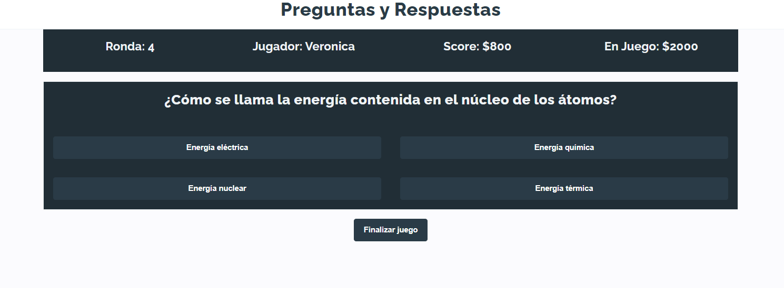

# Trivia de preguntas y respuestas

Este proyecto fue realizado con ReactJs para la prueba técnica de la Liga de Entrenamiento de Sofka.

## Cómo inicializar el proyecto

Los comandos son:

### `yarn install`

Para instalar todas las dependencias del proyecto

### `yarn start`

Corre la aplicación, luego abre [http://localhost:3000](http://localhost:3000) en el navegador.

### `yarn run startjson`

Corre este comando en otra terminal.
Simula una base de datos en local. Ir al navegador [http://localhost:3001](http://localhost:3001). Se tienen 3 endpoints: `preguntas` , `preguntasDefault` y `puntuaciones`

## Cómo jugar

El juego permite jugar con una serie de preguntas por defecto o con nuevas preguntas que usted puede añadir.

### Pantalla principal

Desde aquí puedes añadir preguntas, mirar el tablero de puntuaciones o jugar. Para jugar es obligatorio añadir un nombre.

  

### Crear preguntas

Desde aquí puedes ingresar las preguntas, respuestas, dificultad y nivel para poder jugar. Son necesarias mínimo 5 preguntas por dificultad. Si se opime cancelar, se usan las preguntas por defecto.

 

### Tablero

En esta sección puedes ver todas las puntuaciones de los jugadores.

 

### Juego

Ya en esta sección se ejecuta el juego con las preguntas guardadas por el jugador o con las preguntas por defecto. Podrás retirarte ulilizando el botón de finalizar juego o terminar la partida ganando todas las rondas. Si te equivocas no ganáras nada.

 

### Final del juego

En esta pantalla verás los puntos obtenidos en la partida terminada..

 
